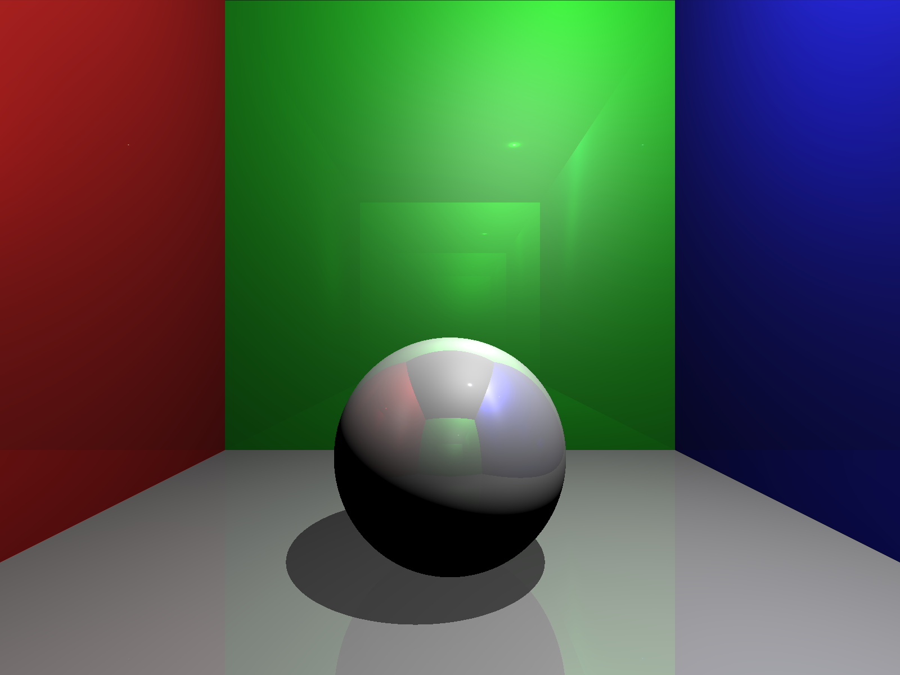

# Python Ray Tracer

A simple python ray tracer that runs on the CPU.

## Features
 
- Pixel Perfect Shadows.
- Reflections with upto 4 bounces.
- Support for multiple lights in the same scene
- Lights follows physcial laws
- HDR Tonemapping
- Metallic Materials

## References

- https://medium.com/swlh/ray-tracing-from-scratch-in-python-41670e6a96f9
- https://en.wikipedia.org/wiki/Blinn–Phong_reflection_model
- https://www.image-engineering.de/library/technotes/958-how-to-convert-between-srgb-and-ciexyz
