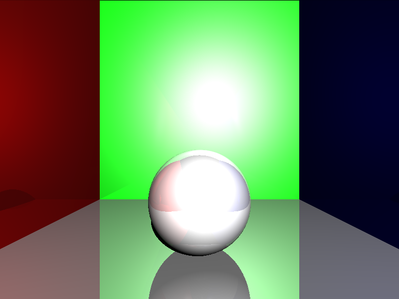

<h1>
        Python Ray Tracer
</h1>

    A simple python ray tracer that runs on the CPU.

 
<h2>Features</h2>
<ul>
    <li>Pixel Perfect Shadows.</li>
    <li>Reflections with upto 4 bounces.</li>
    <li>Support for multiple lights in the same scene</li>
    <li>Lights follow inverse square law</li>
    <li>HDR Tonemapping</li>
    <li>Metallic Materials</li>
</ul>
<h2>References</h2>
<ol>
        <li>https://medium.com/swlh/ray-tracing-from-scratch-in-python-41670e6a96f9</li>
        <li>https://en.wikipedia.org/wiki/Blinn–Phong_reflection_model</li>
        <li>https://www.image-engineering.de/library/technotes/958-how-to-convert-between-srgb-and-ciexyz</li>
</ol>